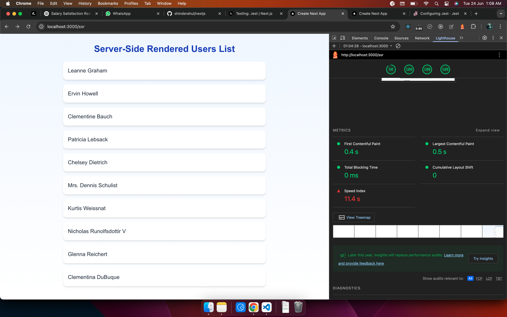
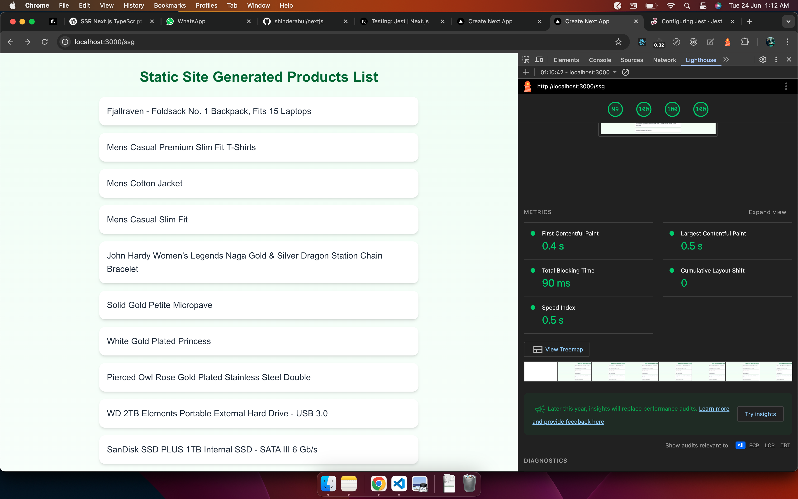
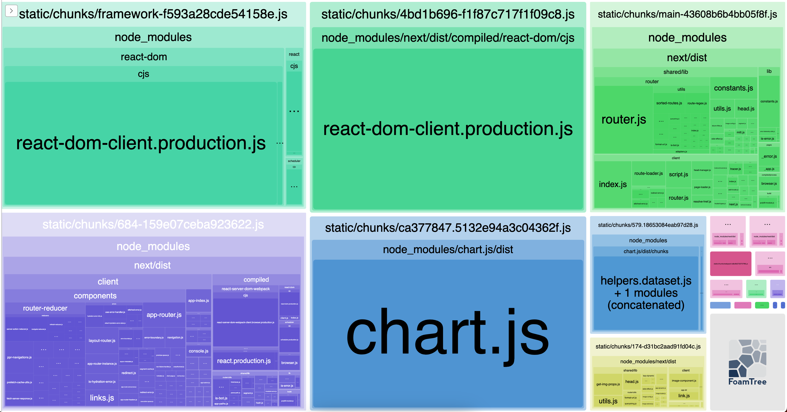

This is a [Next.js](https://nextjs.org) project bootstrapped with [`create-next-app`](https://nextjs.org/docs/app/api-reference/cli/create-next-app).

## What’s Implemented

- **Static Site Generation (SSG) Products Page:**  
  `/ssg` route fetches and displays a list of products at build time using SSG.
- **Server-Side Rendering (SSR) Users Page:**  
  `/ssr` route fetches and displays a list of users on every request using SSR.
- **API Fetching:**  
  Uses `fetch` to retrieve data from external APIs for both products and users.
- **Styling:**  
  Uses Tailwind CSS utility classes for modern UI styling.
- **Font Optimization:**  
  Uses [`next/font`](https://nextjs.org/docs/app/building-your-application/optimizing/fonts) to load [Geist](https://vercel.com/font).
- **Testing:**  
  Includes unit tests for both SSG and SSR pages with mocked API responses.

### Test Coverage

- Renders lists of products and users from mocked API data.
- Handles empty API responses gracefully (renders no items).
- Verifies correct API endpoint and fetch options are used.
- Checks that UI updates correctly for different API responses.

### Lighthouse Reports

Lighthouse performance reports for both SSR and SSG implementations are included below:

#### SSR Lighthouse Report



#### SSG Lighthouse Report



## Code Splitting

🔍 What is Code Splitting?

Code splitting is a performance optimization technique that breaks your JavaScript bundle into smaller pieces, allowing the browser to load only the necessary code when needed. This reduces initial load time and improves user experience, especially in large applications.

📦 Types of Code Splitting Implemented

✅ Route-based Splitting
Each route (page) is lazy-loaded using the framework's routing system. For example, in Next.js, this happens automatically for pages inside the app or pages directory.

✅ Component-based Splitting
Heavy components or rarely used ones are split using React.lazy() or next/dynamic().

// Example using React.lazy

```bash
const About = React.lazy(() => import('@/components/About'));
```

// Example using Next.js dynamic import

```bash
import dynamic from 'next/dynamic';
const Chart = dynamic(() => import('@/components/Chart'));
```

🧪 Webpack Bundle Output


#### Usage

```bash
ANALYZE=true npm run build
# or
ANALYZE=true yarn build
# or
ANALYZE=true pnpm build
```

## 📈 Day 3 – Performance Optimization Summary

Today was focused on improving performance and architecture hygiene in the Next.js App Router setup.

### ✅ Implemented:

- `dynamic()` + `Suspense` to lazy load heavy components like `ChartComponent`
- Verified code-splitting via `next build` and Webpack Bundle Analyzer
- Confirmed `ChartComponent` and charting libraries are loaded in a separate chunk

### 📦 Bundle Optimization:

- `main.js` was initially **346 KB**
- Chart-related libraries are **not included** in the initial JS payload
- Tailwind CSS tree-shaking enabled via correct `content` config in `tailwind.config.js`

### ⚠️ Hydration Mismatch Fixed:

- Issue caused by browser extensions (e.g., Grammarly, ColorZilla) adding unexpected attributes
- Solved by testing in Incognito and adding `suppressHydrationWarning` to `<html>`
- Confirmed clean hydration in dev and production

### 🔥 Final Performance Outcome:

- **Lighthouse Performance Score: 93**
- Fast page load and time to interactive
- Fully optimized build for real-world scale

### 📝 Notes:

- Avoid browser-specific calls (like `Date.now()`, `Math.random()`) in SSR code
- Continue validating hydration by testing routes after every addition

---

📁 Path to production-ready, scalable, performance-first React apps is on track 🚀

## 🧩 Day 4 – Route Grouping & Shared Layouts

- Created clean shared layout using `layout.tsx`
- Added `Header`, `Footer` as reusable common components
- Grouped marketing routes using `(marketing)`:
  - `/about`
  - `/contact`
- Grouped eCommerce routes using `(shop)`:
  - `/products`
  - `/products/[id]`
- Added route-specific metadata and `loading.tsx` fallbacks
- Ensured clean, scalable URL structure with no leakage from folder naming

🧱 ArchitectKit now uses production-level route grouping, dynamic routing, and domain separation — ready for scale.

:

## 🧠 Global State Management with React Context

To enhance scalability and separation of concerns, product data is managed via a global React Context using TypeScript.

### 📁 Folder Structure

```bash
/context
  └── products-context.tsx       # Provider for product state
  └── products-types.ts          # TypeScript types

/hooks
  └── useProductContext.ts       # Custom hook for context access

/types
  └── product.ts                 # Shared Product type

/app/(shop)/layout.tsx          # Wraps pages with <ProductProvider>
```

### 🔄 What It Manages

Product list (fetched from API)
Loading state
Active category filter
setCategory() to update filter

### ✅ Benefits

Shared state across SSR & CSR pages
Easy to integrate filters/search
Cleaner component logic (ProductGrid just consumes context)

### 🎯 Advanced Product Filtering System

The project now includes a production-grade product listing and filtering architecture:

## ✅ Key Features

Category Filtering: Dynamically filter products by category from the FakeStore API.

Search: Implements useDebounce to optimize keyword search performance.

Sorting: Toggle between price and title sorting (asc/desc).

Pagination: Custom-built pagination component with controlled state.

State Management: Powered by React Context API with a clean separation of logic/UI.

Reset Filters: One-click reset to default filter state.

Active Filter Tags: Shows current filter status for better UX.

Client-side and Server-side Integration: Products are fetched server-side and hydrated client-side using hooks like useProductsList.

```bash
context/
  └── ProductContextProvider.tsx   // Global state for filters and pagination

hooks/
  └── useProductsList.ts           // Hydrates product list from SSR
  └── useDebounce.ts               // Optimized debounced search

components/
  ├── filters/
  │   ├── searchBox.tsx
  │   ├── categoryFilter.tsx
  │   ├── sortByDropdown.tsx
  │   ├── pagination.tsx
  │   └── resetFilters.tsx
  └── ProductCard.tsx
  └── ProductGrid.tsx

```

### Component Design Patterns

Implemented scalable component architecture with:

```
✅ Presentational + Container Components

✅ Compound Component Pattern (Tabs implementation)

✅ Controlled vs Uncontrolled Inputs

✅ Prop Getters Pattern for enhanced reusability and a11y
```

These patterns promote flexibility, reusability, and separation of concerns — all traits of architect-level React code.

## Getting Started

First, run the development server:

```bash
npm run dev
# or
yarn dev
# or
pnpm dev
# or
bun dev
```

Open [http://localhost:3000](http://localhost:3000) with your browser to see the result.

You can start editing the page by modifying `app/page.tsx`. The page auto-updates as you edit the file.

This project uses [`next/font`](https://nextjs.org/docs/app/building-your-application/optimizing/fonts) to automatically optimize and load [Geist](https://vercel.com/font), a new font family for Vercel.

## Learn More

To learn more about Next.js, take a look at the following resources:

- [Next.js Documentation](https://nextjs.org/docs) - learn about Next.js features and API.
- [Learn Next.js](https://nextjs.org/learn) - an interactive Next.js tutorial.

You can check out [the Next.js GitHub repository](https://github.com/vercel/next.js) - your feedback and contributions are welcome!

## Deploy on Vercel

The easiest way to deploy your Next.js app is to use the [Vercel Platform](https://vercel.com/new?utm_medium=default-template&filter=next.js&utm_source=create-next-app&utm_campaign=create-next-app-readme) from the creators of Next.js.

Check out our [Next.js deployment documentation](https://nextjs.org/docs/app/building-your-application/deploying) for more details.
